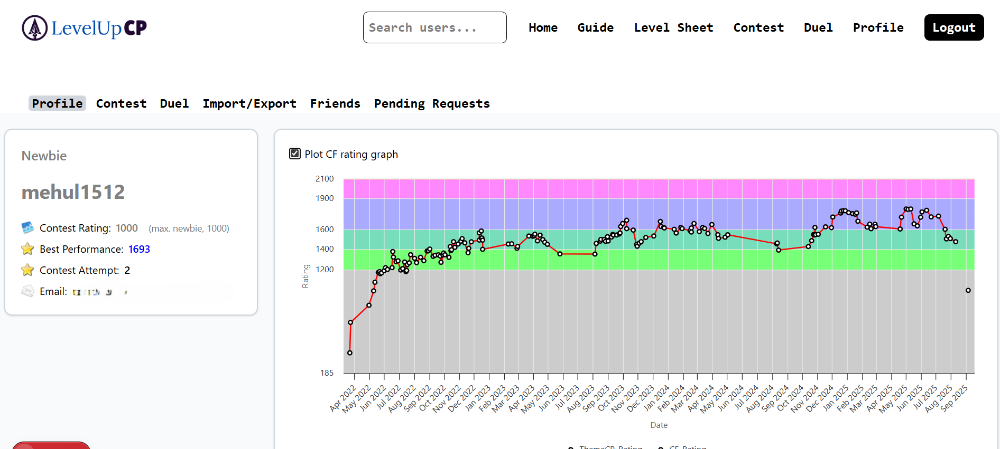

<p align="center">
  
</p>

<h1 align="center">LevelUpCP</h1>

<p align="center">
  A Competitive Programming platform with level-based progression, virtual contests, and 1v1 challenges.  
  Inspired by <a href="https://codeforces.com/blog/entry/136704" target="_blank">ThemeCP</a>.
</p>

---

## 🚀 Features

- **Level-based Progression:** 109 levels to gradually improve problem-solving skills.
- **Virtual Contests:** 4-problem contests with a 120-minute timer.
- **Friends & 1v1 Challenges(Duels):** Compete with friends in real-time.
- **Performance Tracking:** Local rating, contest history, and deltas stored for every attempt.
- **Tag-based Practice:** Choose mixed contests or focus on specific topics like DP, Greedy, etc.

---

---

## 🖼️ Demo

### 🖼️ Demo Video

<p align="center">
  [Watch Demo Video](https://github.com/me-hu-l/themeCP/raw/b42889d3bd3de5520fee1d3028392afd2d0cf50a/demo/Demo_video.mp4)
<!--   <video src="demo/Demo_video.mp4" width="700" controls>
    Your browser does not support the video tag.
  </video> -->
</p>

---


### 👤 Profile Page  
Login with your Google account and add your Codeforces handle to personalize your experience.

<p align="center">
  
</p>

---

### 📜 History  
Track your past **contests** and **1v1 duels** with detailed performance stats.

<p align="center">
  
  
</p>

---

### 🎯 Create  
Host local contests and duels with friends — choose levels and topics (just like ThemeCP!).

<p align="center">
  
  
</p>

---

### ⚔️ Compete  
Solve theme-based contests progressively, or challenge your friends to a **1v1 duel**.  
Both participants’ Codeforces submissions are tracked in **real-time** and scores are updated live.

<p align="center">
  
  
</p>

---

### 🤝 Friends  
Search for your friends, view their profiles, and add them to challenge them to duels.

<p align="center">
  
  
</p>

---


## 🛠️ Tech Stack

- **Frontend:** Next.js (React)
- **Backend:** FastAPI (Python)
- **Database:** PostgreSQL
- **Auth:** JWT-based authentication
- **Deployment:** Vercel (frontend) + Render (backend)

---

## 💻 Getting Started

Clone the repo and start both frontend and backend locally.

```bash
git clone https://github.com/<your-username>/themecp.git
cd themecp


